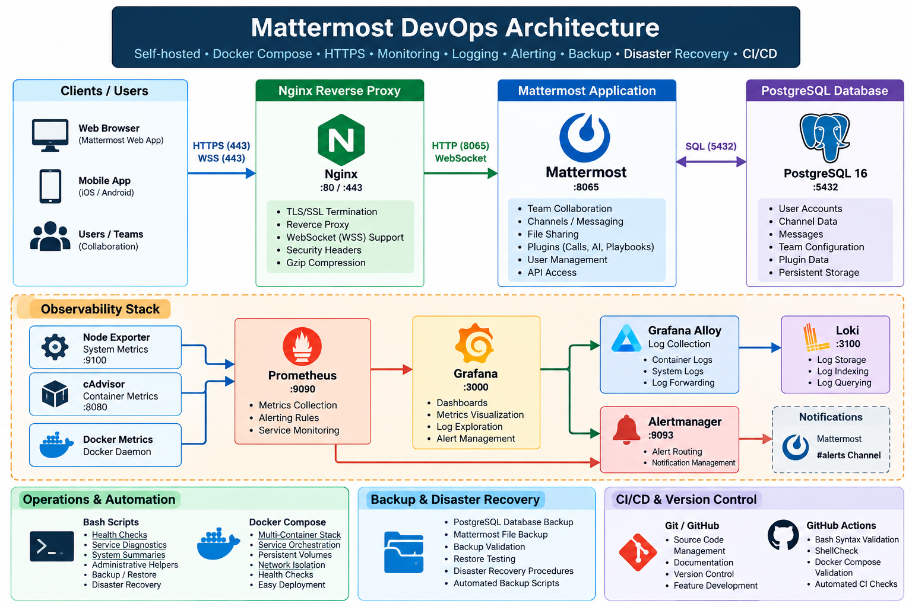

# Mattermost DevOps Project

A complete self-hosted **Mattermost DevOps and SRE implementation** built with Docker Compose, PostgreSQL, Nginx, HTTPS/TLS, Prometheus, Grafana, Loki, Grafana Alloy, Alertmanager, Bash automation, backup/restore workflows, disaster recovery procedures, security hardening, and GitHub Actions CI validation.

This project demonstrates the operational lifecycle of a containerized collaboration platform:

**Deployment → Reverse Proxy → HTTPS → WebSocket/WSS → Monitoring → Logging → Alerting → Backup → Restore → Disaster Recovery → Security → Automation → CI/CD**

---

## 📌 Project Overview

The project was built to practice and demonstrate practical DevOps and SRE operations around a self-hosted Mattermost platform.

### Core Platform

- Mattermost Team Edition
- PostgreSQL 16
- Docker Compose
- Nginx reverse proxy
- HTTPS/TLS
- WebSocket/WSS realtime communication

### Observability

- Prometheus
- Node Exporter
- cAdvisor
- Grafana
- Loki
- Grafana Alloy
- Alertmanager
- Mattermost alert notifications

### Operations

- Bash automation
- Health checks
- Docker service diagnostics
- System summaries
- Administrative helpers
- Database backup
- File backup
- Backup validation
- Restore testing
- Disaster recovery procedures

### Engineering Practices

- Security hardening
- Secret handling
- Git/GitHub version control
- ShellCheck
- Bash syntax validation
- Docker Compose validation
- GitHub Actions CI

---

## 🏗️ Architecture



```text
Browser
   │ HTTPS / WSS
   ▼
Nginx :443
   │
   ▼
Mattermost :8065
   │
   ▼
PostgreSQL 16

Observability:
Node Exporter ──┐
cAdvisor ───────┼──► Prometheus ──► Grafana
                │          │
Docker Logs ─► Alloy ──► Loki
                           │
Prometheus ──► Alertmanager ──► Mattermost #alerts

Engineering:
Bash Automation ──► Health / Diagnostics / Backup
Git ──► GitHub ──► GitHub Actions CI
```

---

## 🛠️ Technology Stack

| Category | Technology |
|---|---|
| Application | Mattermost Team Edition |
| Database | PostgreSQL 16 |
| Containers | Docker |
| Orchestration | Docker Compose |
| Reverse Proxy | Nginx |
| TLS | OpenSSL / Nginx |
| Metrics | Prometheus |
| Host Metrics | Node Exporter |
| Container Metrics | cAdvisor |
| Dashboards | Grafana |
| Logs | Loki |
| Log Collection | Grafana Alloy |
| Alerting | Alertmanager |
| Notifications | Mattermost Incoming Webhook |
| Automation | Bash |
| Version Control | Git / GitHub |
| CI | GitHub Actions |
| OS | Ubuntu 24.04.4 LTS |
| Environment | Windows + WSL2 |

---

## 🚀 What Was Implemented

### Mattermost Deployment

Mattermost Team Edition was deployed using Docker Compose with PostgreSQL 16 as the database backend.

Persistent application storage covers:

- Mattermost configuration
- Application data
- Logs
- Plugins
- Client plugins
- Search indexes
- PostgreSQL data

### PostgreSQL

PostgreSQL 16 provides the Mattermost database backend through the Docker internal network.

```text
Mattermost
    │
    ▼
postgres:5432
    │
    ▼
PostgreSQL 16
```

PostgreSQL port `5432` is not exposed to the host.

### Nginx Reverse Proxy

Nginx provides the application entry point:

```text
Client
  │
  ▼
Nginx :443
  │
  ▼
Mattermost :8065
```

Mattermost is bound to localhost:

```text
127.0.0.1:8065
```

### HTTPS / TLS

HTTPS was configured through Nginx using a local self-signed certificate for the development environment.

Implemented:

- TLS 1.2
- TLS 1.3
- TLS 1.0 disabled
- TLS 1.1 disabled
- HTTP to HTTPS redirect
- Protected private key permissions

### WebSocket / Realtime

Mattermost realtime communication was configured through the Nginx reverse proxy.

WebSocket connectivity was verified through:

```text
wss://localhost/api/v4/websocket
```

with a successful HTTP `101 Switching Protocols` response.

---

## 📊 Monitoring & Observability

The project implements a complete monitoring pipeline.

```text
Node Exporter ──┐
cAdvisor ───────┼──► Prometheus ──► Grafana
                │          │
                │          └──► Alertmanager
                │                    │
                │                    ▼
                │              Mattermost #alerts
                │
Docker Logs ──► Grafana Alloy ──► Loki ──► Grafana
```

### Prometheus

Prometheus is used for:

- Metrics collection
- Infrastructure monitoring
- Container monitoring
- Alert evaluation
- Mattermost monitoring rules

### Grafana

Grafana provides visualization for:

- System metrics
- Container metrics
- Prometheus metrics
- Loki logs
- Operational troubleshooting

### Loki + Grafana Alloy

Docker logs flow through:

```text
Docker Containers
       │
       ▼
Grafana Alloy
       │
       ▼
Loki
       │
       ▼
Grafana
```

### Alertmanager

Alertmanager receives Prometheus alerts and sends notifications to Mattermost.

Example flow:

```text
Prometheus
    │
    ▼
Alertmanager
    │
    ▼
Mattermost #alerts
```

Alert testing included taking Mattermost down and verifying alert and recovery notifications.

The real webhook URL is excluded from Git.

---

## 💾 Backup & Disaster Recovery

The project includes automated backup and restore procedures.

### Database Backup

PostgreSQL is backed up using `pg_dump` in custom format.

The resulting backup can be inspected using:

```bash
pg_restore -l backups/mattermost-db.dump
```

### Mattermost File Backup

Persistent Mattermost application data is archived while preserving ownership and permissions.

### Backup Integrity

The backup workflow validates:

- Database dump integrity
- Archive integrity
- SHA256 checksums
- Backup metadata
- File ownership
- Backup manifest

### Restore Testing

A complete restore test was performed in an isolated environment.

The validation included:

- PostgreSQL restoration
- Mattermost file restoration
- Database connectivity
- Application startup
- API login
- Table validation
- User validation
- Team validation
- Channel validation
- Post validation
- Cleanup after testing

The tested restore environment contained:

```text
99 tables
5 users
1 team
13 channels
31 posts
```

### Disaster Recovery

Detailed recovery procedures cover:

- Recovery prerequisites
- Backup selection
- Database restoration
- File restoration
- Permission restoration
- Mattermost startup
- Validation
- Recovery verification
- Rollback considerations

See [Disaster Recovery Documentation](docs/phase-15-disaster-recovery.md).

---

## 🔐 Security Hardening

Security improvements include:

### Localhost-only Service Bindings

Internal services are restricted to localhost where external exposure is unnecessary.

Examples:

```text
127.0.0.1:8065   Mattermost
127.0.0.1:9091   Docker Prometheus
127.0.0.1:9093   Alertmanager
127.0.0.1:12345  Alloy
127.0.0.1:8080   cAdvisor
127.0.0.1:3100   Loki
127.0.0.1:9100   Node Exporter
127.0.0.1:3000   Grafana
```

Nginx is the intended external entry point on:

```text
:80
:443
```

PostgreSQL does not expose host port `5432`.

### Secret Handling

The real Mattermost webhook URL is excluded from Git.

The repository contains only:

```text
monitoring/alertmanager/mattermost-webhook-url.example
```

The actual secret is ignored through `.gitignore`.

### TLS Hardening

The Nginx TLS configuration:

- Disables TLS 1.0
- Disables TLS 1.1
- Allows TLS 1.2
- Allows TLS 1.3
- Redirects HTTP to HTTPS
- Protects the private key

---

## 🤖 Bash Automation

The project contains reusable operational scripts.

| Script | Purpose |
|---|---|
| `health-check.sh` | Application and infrastructure health checks |
| `docker-health.sh` | Docker and Compose health validation |
| `diagnose-services.sh` | Collect service diagnostics |
| `backup-mattermost.sh` | Database and file backup automation |
| `mattermost-admin.sh` | Mattermost administration helper |
| `mattermost-send.sh` | Mattermost message helper |
| `system-summary.sh` | System and service summary |
| `lib/common.sh` | Shared Bash functions |

The scripts use strict Bash error handling:

```bash
set -Eeuo pipefail
```

and shared logging/error-handling functions.

ShellCheck validation is included.

---

## 🔄 CI Validation

GitHub Actions validates the repository on pushes and pull requests to `main`.

The CI workflow performs:

### Bash Syntax Validation

```bash
bash -n
```

### ShellCheck

```bash
shellcheck
```

### Git Validation

```bash
git diff --check
```

### Docker Compose Validation

```bash
docker compose config -q
```

Workflow:

```text
Git Push / Pull Request
          │
          ▼
    GitHub Actions
          │
    ┌─────┼───────────┐
    ▼     ▼           ▼
 Bash  ShellCheck  Compose
Syntax              Config
    │     │           │
    └─────┴─────┬─────┘
                ▼
             Validation
```

---

## 📁 Repository Structure

```text
mattermost/
│
├── .github/
│   └── workflows/
│       └── ci.yml
│
├── monitoring/
│   ├── alertmanager/
│   │   ├── alertmanager.yml
│   │   └── mattermost-webhook-url.example
│   │
│   ├── alloy/
│   │   └── config.alloy
│   │
│   ├── loki/
│   │   └── loki-config.yml
│   │
│   └── prometheus/
│       ├── prometheus.yml
│       └── rules/
│           └── mattermost-alerts.yml
│
├── scripts/
│   ├── backup-mattermost.sh
│   ├── diagnose-services.sh
│   ├── docker-health.sh
│   ├── health-check.sh
│   ├── mattermost-admin.sh
│   ├── mattermost-send.sh
│   ├── system-summary.sh
│   └── lib/
│       └── common.sh
│
├── docs/
│   ├── MATTERMOST-DEVOPS-FINAL-DOCUMENTATION.md
│   ├── phase-04-administration.md
│   └── phase-15-disaster-recovery.md
│
├── docker-compose.yml
├── .gitignore
└── README.md
```

---

## 🚀 Quick Start

### Prerequisites

```text
Windows
WSL2
Ubuntu 24.04.4 LTS
Docker
Docker Compose
Git
```

Verify:

```bash
docker --version
docker compose version
git --version
```

### Clone

```bash
git clone https://github.com/janagans941/mattermost-devops.git
cd mattermost-devops
```

### Start the Stack

```bash
docker compose up -d
```

Check services:

```bash
docker compose ps
```

Check Mattermost logs:

```bash
docker compose logs -f mattermost
```

### Health Check

```bash
./scripts/health-check.sh
```

Docker health:

```bash
./scripts/docker-health.sh
```

System summary:

```bash
./scripts/system-summary.sh
```

Diagnostics:

```bash
./scripts/diagnose-services.sh
```

---

## 📚 Documentation

### Complete DevOps Documentation

[MATTERMOST-DEVOPS-FINAL-DOCUMENTATION.md](docs/MATTERMOST-DEVOPS-FINAL-DOCUMENTATION.md)

The complete operational reference covers:

- Deployment
- Docker
- PostgreSQL
- Mattermost
- WebSocket/realtime
- Nginx
- HTTPS/TLS
- Prometheus
- Grafana
- Loki
- Alloy
- cAdvisor
- Alertmanager
- Backup
- Restore
- Disaster recovery
- Security hardening
- Bash automation
- Git
- GitHub Actions
- Troubleshooting
- Operational runbooks

### Administration

[Phase 04 — Administration](docs/phase-04-administration.md)

### Disaster Recovery

[Phase 15 — Disaster Recovery](docs/phase-15-disaster-recovery.md)

---

## 🧪 Useful Operational Commands

```bash
docker compose ps
docker compose logs --tail=100 mattermost
docker compose logs --tail=100 postgres
docker compose config

./scripts/health-check.sh
./scripts/docker-health.sh
./scripts/diagnose-services.sh
./scripts/system-summary.sh

ss -tulpn
git status
```

---

## 🎯 DevOps Skills Demonstrated

### Linux Administration

- Ubuntu
- System services
- Networking
- Permissions
- Processes
- Logs
- Disk and memory troubleshooting

### Docker

- Docker Compose
- Container networking
- Persistent volumes
- Service dependencies
- Container troubleshooting
- Health validation

### Reverse Proxy & Networking

- Nginx
- HTTP/HTTPS
- TLS
- WebSockets
- WSS
- Proxy headers
- Localhost service binding

### Monitoring

- Prometheus
- Grafana
- Node Exporter
- cAdvisor
- Alertmanager

### Logging

- Loki
- Grafana Alloy
- Docker log collection
- Centralized log querying

### Reliability

- Health checks
- Automated diagnostics
- Backup
- Restore
- Disaster recovery
- Recovery validation

### Security

- Service isolation
- Localhost bindings
- TLS hardening
- Secret handling
- File permissions

### Automation

- Bash
- Error handling
- Logging
- Validation
- Operational runbooks

### CI/CD

- Git
- GitHub
- GitHub Actions
- ShellCheck
- Automated validation
- Docker Compose validation

---

## 📌 Project Outcomes

The project resulted in an operational environment where:

- Mattermost runs as a containerized application.
- PostgreSQL provides persistent database storage.
- Nginx provides the HTTPS entry point.
- WebSocket realtime communication works through the reverse proxy.
- Prometheus collects infrastructure and container metrics.
- Grafana provides visualization.
- Loki and Alloy provide centralized Docker logging.
- Alertmanager sends monitoring alerts to Mattermost.
- Backup automation creates validated database and file backups.
- Restore procedures were tested in an isolated environment.
- Disaster recovery procedures are documented.
- Internal service ports are restricted to localhost.
- Secrets are excluded from version control.
- Bash automation simplifies routine operations.
- GitHub Actions validates repository changes automatically.

---

## 🔗 Repository

[GitHub Repository](https://github.com/janagans941/mattermost-devops)

---

## 👨‍💻 Author

**Janagan S**

DevOps / Linux System Administration / Cloud & Infrastructure

Focus areas:

```text
Linux
Docker
AWS
DevOps
Monitoring
Automation
CI/CD
System Administration
Infrastructure
```

---

## 📄 Usage

This repository is a personal DevOps learning, portfolio, and demonstration project.

Review the detailed documentation and adapt secrets, TLS certificates, networking, credentials, and operational settings before using similar configurations in a production environment.
